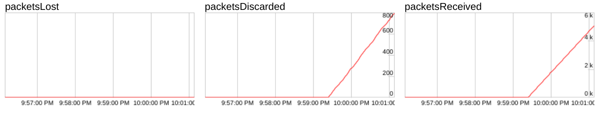
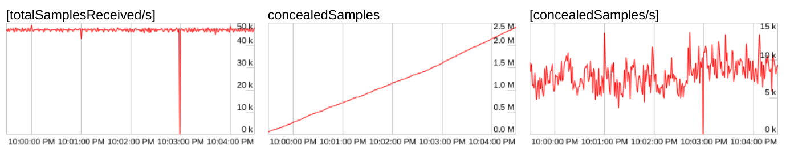
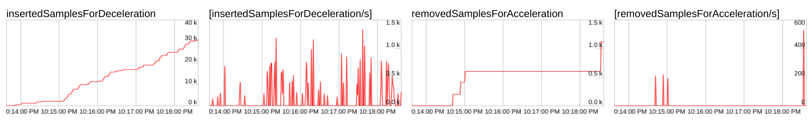
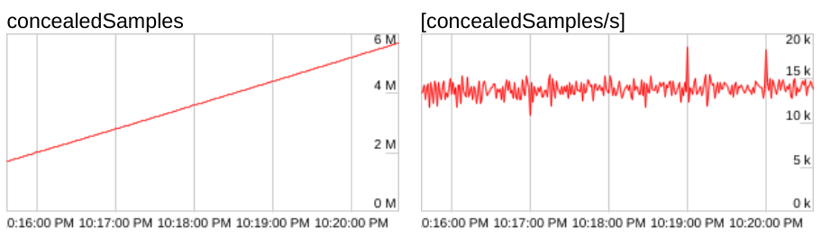
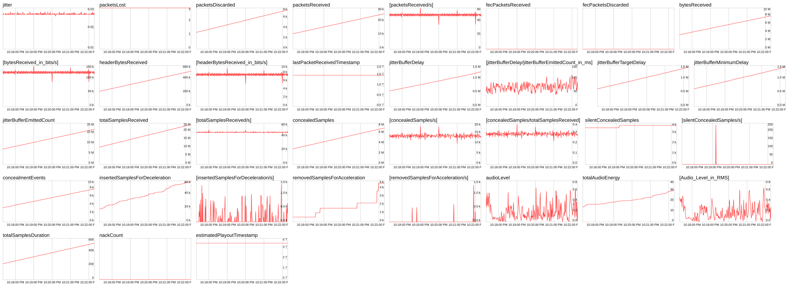

# WebRtc jitter issue with Kinesis and GStreamer

## Background
 
Recently I've been working on a project where we have an issue
with choppy audio. This project ingests RTP data from an RTSP
server. This server runs on an Axis-M1135 camera. This is what
we're doing, in a nutshell: The RTSP server gives us a H264 and
Opus RTP stream. With a C-based application we initialize a
GStreamer pipeline. This pipeline contains an app sink. The app
sink allows us to retrieve the Opus and H264 packets in the
app. We receive the packets by connecting to the _new-sample_
messages. These messages are dispatched by the `GstBus` of the
pipeline. Once we receive these packets in our callbacks, we hand
them over to the [Kinesis][ksdk] WebRtc SDK. We setup a `Frame`
variable that we then pass into [WriteFrame()][wf]. The Kinesis
WebRtc SDK makes the stream available via WebRtc in the browser.

_Experimental GStreamer pipeline that we've used:_

```bash
rtspsrc location=rtsp://example.com/axis-media/media.amp latency=0 buffer-mode=none name=src 
appsink emit-signals=TRUE name=appsink-video 
appsink emit-signals=TRUE name=appsink-aac 
appsink emit-signals=TRUE name=appsink-opus
src. ! rtph264depay ! h264parse config-interval=-1 ! video/x-h264,stream-format=byte-stream,alignment=au ! queue ! appsink-video. 
src. ! rtpopusdepay ! tee name=t 
t. ! queue ! opusdec ! audioconvert ! avenc_aac bitrate=128000 ! queue ! appsink-aac. 
t. ! queue ! appsink-opus.
```

## Choppy audio

The issue we experience is that the audio that we hear in the
browser sounds choppy. With choppy, I mean that it sounds like
certain tiny pieces are removed. This matches our findings. We
also thought that the issue might be caused by the use of
incorrect samplerates or bitdepths. Though when there would be a
mismatch between samplerate or bitdepth, the sound would have
been different from what we hear now. Typically issues with
samplerate or bitdepth are more distinct. I made this recording
as an example of what we heard:

<audio controls>
  <source src="./audio/choppy.mp3" type="audio/mpeg">
</audio>

[ksdk]: https://github.com/awslabs/amazon-kinesis-video-streams-webrtc-sdk-c
[wf]: https://github.com/awslabs/amazon-kinesis-video-streams-webrtc-sdk-c/blob/master/src/source/PeerConnection/Rtp.c#L184

## Looking at the graphs

Before we can find the root cause for this issue we had to
understand what the issue exactly was. We opened
[chrome://webrtc-internals][cint] and started looking at the audio
graphs. This image shows typical graphs that we get:

> 

One thing to notice is that no packets are lost. But the packets
are discarded. To figure out why the packets are discarded we
looked at some other graphs that [chrome://webrtc-internals][cint] provides. 
W3C defines discarded packets as:

> _The cumulative number of RTP packets discarded by the jitter buffer due to late or early-arrival, i.e., these packets are not played out. RTP packets discarded due to packet duplication are not reported in this metric [XRBLOCK-STATS]. Calculated as defined in [RFC7002] section 3.2 and Appendix A.a._

When we looked a bit further we noticed that many samples are
concealed. Which the W3C describes as:

> _Only exists for audio. The total number of samples that are concealed samples. A concealed sample is a sample that was replaced with synthesized samples generated locally before being played out. Examples of samples that have to be concealed are samples from lost packets (reported in packetsLost) or samples from packets that arrive too late to be played out (reported in packetsDiscarded)._

This image shows a typical graph that we saw while looking into
this:

> 

There are a couple of graphs that show the reasons of
concealment. Though, I'm not entirely sure if these represent all
the concealed samples. The image below shows the concealed
samples for acceleration or deceleration.  _Note: this screenshot
was from a different test than the screenshots above_.

> 

When we look at the totals, we can see that there are a lot more
concealed samples than the inserted and removed samples show in
the graphs above. I'm not sure why these totals don't match.

> 

Here we can see all the graphs from a typical test:

> 

[cint]: chrome://webrtc-internals

## Inspecting Chromiums jitter buffer

After looking at the graphcs I still wasn't sure why so many
packets were discarded and concealed I wanted to dive a bit
deeper. I wanted to know exactly why packets were concealed. To
do this I compiled chromium from source. Then I started looking
into the code. I wanted to figure out what code was responsible
of keeping track of concealed packets. It turned out that the
neteq code from the WebRtc library takes care this. I added some
logs into [decision_logic][wd], which makes a decision about what
to do with audio packets: e.g. why they should be
concealed. _Note: this is my current understanding and I might be
wrong._

[wd]: https://webrtc.googlesource.com/src/+/refs/heads/main/modules/audio_coding/neteq/decision_logic.cc

I started logging the `last_playout_delay_ms` value in the
`GetDecision()` function. I noticed that the value would change
quite a lot compared to streams which were playing back
correctly. You can see a longer log [here][declog]

[declog]: ./logs/playout-delay.log

```bash
playout_delay_ms = 85,  highThreshold()<<2=480, hightThreshold()=120, LowThreshold()=75
playout_delay_ms = 85,  highThreshold()<<2=480, hightThreshold()=120, LowThreshold()=75
playout_delay_ms = 85,  highThreshold()<<2=480, hightThreshold()=120, LowThreshold()=75
playout_delay_ms = 98,  highThreshold()<<2=480, hightThreshold()=120, LowThreshold()=75
playout_delay_ms = 98,  highThreshold()<<2=480, hightThreshold()=120, LowThreshold()=75
playout_delay_ms = 105, highThreshold()<<2=480, hightThreshold()=120, LowThreshold()=75
playout_delay_ms = 105, highThreshold()<<2=480, hightThreshold()=120, LowThreshold()=75
playout_delay_ms = 98,  highThreshold()<<2=480, hightThreshold()=120, LowThreshold()=75
playout_delay_ms = 98,  highThreshold()<<2=480, hightThreshold()=120, LowThreshold()=75
playout_delay_ms = 98,  highThreshold()<<2=480, hightThreshold()=120, LowThreshold()=75
playout_delay_ms = 98,  highThreshold()<<2=480, hightThreshold()=120, LowThreshold()=75
playout_delay_ms = 104, highThreshold()<<2=480, hightThreshold()=120, LowThreshold()=75
playout_delay_ms = 104, highThreshold()<<2=480, hightThreshold()=120, LowThreshold()=75
playout_delay_ms = 98,  highThreshold()<<2=480, hightThreshold()=120, LowThreshold()=75
playout_delay_ms = 98,  highThreshold()<<2=480, hightThreshold()=120, LowThreshold()=75
playout_delay_ms = 104, highThreshold()<<2=480, hightThreshold()=120, LowThreshold()=75
playout_delay_ms = 104, highThreshold()<<2=480, hightThreshold()=120, LowThreshold()=75
playout_delay_ms = 104, highThreshold()<<2=480, hightThreshold()=120, LowThreshold()=75
playout_delay_ms = 104, highThreshold()<<2=480, hightThreshold()=120, LowThreshold()=75
playout_delay_ms = 104, highThreshold()<<2=480, hightThreshold()=120, LowThreshold()=75
playout_delay_ms = 104, highThreshold()<<2=480, hightThreshold()=120, LowThreshold()=75
playout_delay_ms = 105, highThreshold()<<2=480, hightThreshold()=120, LowThreshold()=75
playout_delay_ms = 105, highThreshold()<<2=480, hightThreshold()=120, LowThreshold()=75
playout_delay_ms = 100, highThreshold()<<2=480, hightThreshold()=120, LowThreshold()=75
playout_delay_ms = 100, highThreshold()<<2=480, hightThreshold()=120, LowThreshold()=75
playout_delay_ms = 99,  highThreshold()<<2=480, hightThreshold()=120, LowThreshold()=75
playout_delay_ms = 99,  highThreshold()<<2=480, hightThreshold()=120, LowThreshold()=75
playout_delay_ms = 99,  highThreshold()<<2=480, hightThreshold()=120, LowThreshold()=75

```

## Timestamps 

As these playout delays in neteq changed often, I started looking
into the timestamps. I added some code that would log the delta
between successive audio timestamps. At the same time I created a
capture from the RTP streams using tshark. I wanted to compare if
the timestamps I received from GStreamer were correct.

_I've used something like this to capture the RTP streams from the
Axis camera. This capture.pcap file can be opened in Wireshark to
inspect the data:_

```bash
tshark -w capture.pcap -i 1 host <IP>
```

Once I had this [capture][wcap], I noticed that indeed, not every
packet had the same timestamp delta. I would expect that every
delta would be 960. The reason for this, is that in our case,
Opus encodes 20ms of audio. The timestamp values are based on the
samplerate and the number of encoded samples. As we are using a
samplerate of 48.000 and encoding 20ms of audio, we would expect
that the timestamp would increment by exactly 960:

```
0.02 / (1/48000)= 960
```

When we looked at the delta between timestamps using our
Wireshark capture we noticed that this was not always the
case. Sometimes the delta was 952, 956, 963, etc. Though the
number of bytes in each packet is exactly 320 bytes. For a full
list of timestamps see [this file][lts]. 

[lts]: ./logs/wireshark-capture-timestamps.log
[wcap]: ./logs/rtp-capture.pcapng


```bash
RTP.TIMESTAMP	DELTA
---------------------
1172502739	        0
1172503387	      648
1172504347	      960
1172505307	      960
1172506266	      959
1172507226	      960
1172508186	      960
1172509138	      952
1172510098	      960
1172511058	      960
1172512018	      960
1172512978	      960
1172513938	      960
1172514898	      960
1172515854	      956
1172516814	      960
1172517774	      960
1172518737	      963

```

So this is where it things seem to go wrong. Although not
entirely sure yet, I think that because the timestamps do not
increment with 960 for each 20ms audio packet, *but* each packet
does contain 20ms, there the player must decelarate or
accelerate (right?).

## Unanswered questions

I'm not sure how I should deal with this situation? What does it
mean when the timestamps of the audio RTP packets increments with
a different amount then the number of samples/duration they
contain. Or maybe they contain a different amount of samples?
And why is the jitter buffer in libwebrtc concealing so many
packets?
